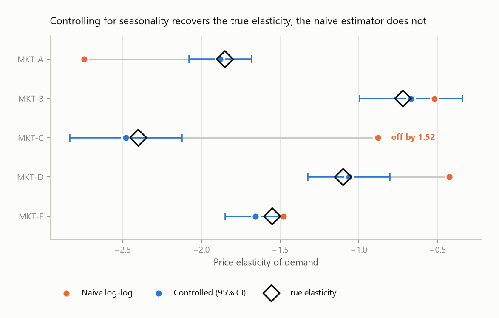
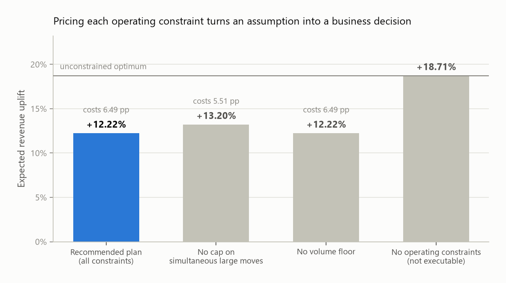
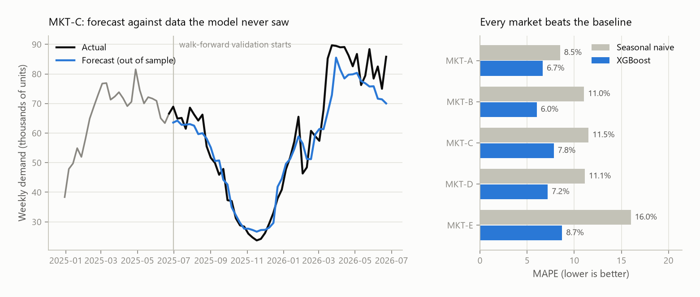
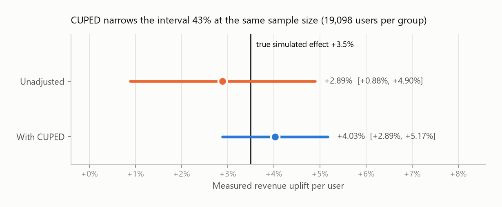
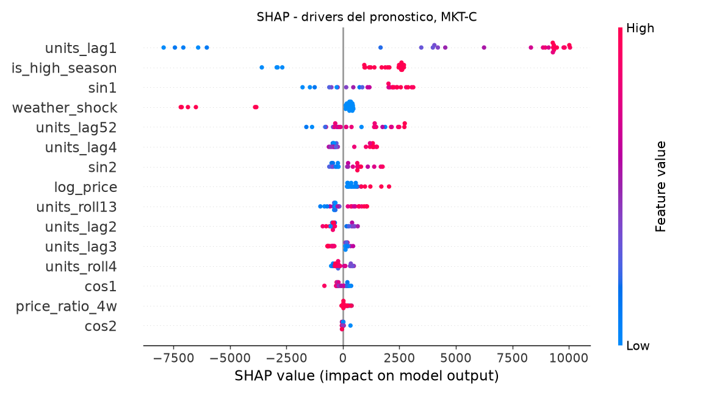

# pricing-demand-lab

[](https://github.com/Threeangletriangle/pricing-demand-lab/actions/workflows/ci.yml)

An end-to-end pricing and demand workflow for a multi-market operation: estimate elasticity,
forecast demand, decide prices under real operating constraints, and measure whether the
decision worked.

The four modules are the four steps of the same decision. Most pricing repositories stop at
step two, which is where the interesting part starts.

```
elasticity  ──►  forecast  ──►  optimize  ──►  experiment
   how does        what will      what price      did it
   demand          demand be      should we       actually
   respond?                       set?            work?
```

**All data here is synthetic and generated by `src/generate_data.py`.** No client data is used.
That is a deliberate choice, not a limitation: the simulator has a *known* ground truth, so every
estimator can be scored against the parameter that produced the data. On real data you never get
to check whether your elasticity estimate is right. Here you do, and that is how you find out
whether the method is sound before you trust it on data where you cannot.

---

## The four results, in four charts

<table>
<tr>
<td width="50%"></td>
<td width="50%"></td>
</tr>
<tr>
<td><b>1. Elasticity.</b> The naive estimator misses by up to 1.52 and in an inconsistent
direction. The controlled one covers the truth in all five markets.</td>
<td><b>3. Optimization.</b> Each operating constraint is priced in points of uplift, which
turns a hardcoded assumption into a decision someone can argue about.</td>
</tr>
</table>



**2. Forecasting.** Validated walk-forward, never on data the model has seen, and always
reported against the baseline a model has to beat to justify its maintenance cost.



**4. Experimentation.** CUPED narrows the interval 43% at the same sample size. Both intervals
contain the true simulated effect; the unadjusted one is too wide to act on.

---

## Results

Everything below is reproduced by running the modules. Numbers come from the committed seed.

### 1. Elasticity — controlling for seasonality is not optional

Price does not move at random. It moves with the season, alongside demand. An uncontrolled
log-log regression lets the price coefficient absorb the seasonality, and the bias is large:

| Market | True | Naive log-log | Controlled | 95% CI | Truth in CI |
|--------|------|---------------|------------|--------|-------------|
| MKT-A | -1.85 | -2.74 | **-1.88** | [-2.08, -1.68] | yes |
| MKT-B | -0.72 | -0.52 | **-0.67** | [-1.00, -0.34] | yes |
| MKT-C | -2.40 | -0.88 | **-2.48** | [-2.84, -2.12] | yes |
| MKT-D | -1.10 | -0.43 | **-1.06** | [-1.33, -0.80] | yes |
| MKT-E | -1.55 | -1.48 | **-1.66** | [-1.85, -1.46] | yes |

Mean absolute bias: **0.672 naive vs 0.060 controlled**. Coverage of the 95% interval: 5/5.

Note the direction of the naive error is not consistent — MKT-A is overstated, MKT-C is
understated by a factor of nearly three. An analyst who checks one market and finds the naive
estimate "close enough" would carry the wrong conclusion into every other market.

One more result worth reading carefully: a fixed-effects panel regression returns **-0.84**,
while the simple average of the true elasticities is **-1.52**. Pooling across markets does not
give you an average elasticity. It gives you a number that describes no market in the portfolio.

### 2. Forecasting — always report the baseline

Weekly demand per market, XGBoost on lag and Fourier seasonality features, validated
**walk-forward** over four blocks of 13 weeks. A random k-fold on time series trains on the
future and scores the past.

| Market | Model MAPE | Seasonal-naive MAPE | Lift | Worst fold |
|--------|-----------|---------------------|------|------------|
| MKT-A | 6.66% | 8.49% | 21.6% | 8.39% |
| MKT-B | 6.02% | 11.03% | 45.5% | 11.92% |
| MKT-C | 7.83% | 11.51% | 31.9% | 9.97% |
| MKT-D | 7.19% | 11.11% | 35.3% | 12.66% |
| MKT-E | 8.72% | 16.00% | 45.5% | 14.58% |

Mean 7.28% against a baseline of 11.63%. The worst-fold column is there on purpose: a mean MAPE
hides the quarter where the model failed, and that quarter is what a capacity planner remembers.

Every run is logged to **MLflow** — parameters, metrics, validation scheme, and model — on a
SQLite backend. The registry answers the question that comes up three months later: why is *this*
model the one in production.

**SHAP** explains the drivers. For MKT-C the ranking is last week's demand, high-season flag,
annual seasonality, weather shock, then price. The point of SHAP over feature importance is that
it works case by case: it says what pushed *this* forecast up or down, which is what a commercial
team can actually argue with.



### 3. Optimization — a MIP, because the constraints are discrete

Prices are chosen from a discrete grid (commercial prices ship in steps, not on a continuum),
one price per market, subject to a volume floor, a per-market change cap, and — the constraint
that forces integrality — **at most K markets may move sharply at the same time**. That limit
cannot be written without binary variables, and it is exactly the kind of rule a commercial team
imposes because someone has to have the conversation with each operator.

Recommended plan: +12.22% revenue, +31.07% volume.

The module also prices each constraint:

| Scenario | Revenue uplift | Volume | Cost vs unconstrained |
|----------|---------------|--------|----------------------|
| Full plan (all constraints) | +12.22% | +31.07% | 6.49 pp |
| No cap on large moves | +13.20% | +34.14% | 5.51 pp |
| No volume floor | +12.22% | +31.07% | 6.49 pp |
| No operating constraints | +18.71% | +50.23% | — |

That last column is the useful one. It converts an operating constraint from a hardcoded
assumption into a business decision someone can argue about: the cap on simultaneous large moves
costs roughly one point of uplift, and the volume floor is not binding at all here. Both facts
belong in the conversation with Revenue Management, not buried in the source.

### 4. Experiment — the number that decides deployment

The optimizer proposes a plan. This module answers whether it worked.

- **Power first.** Detecting a 3% relative effect needs 19,098 users per group; 2% needs 42,970.
  An underpowered test is not a small test — it is a test that returns "not significant"
  whether or not the effect is real, and that ambiguity costs more than not running it.
- **A/A test** on the assignment pipeline: -0.12%, p = 0.904. If this comes back significant,
  the problem is the randomization, not the business.
- **Result:** +2.89% unadjusted, CI [+0.88%, +4.90%]. With **CUPED** using pre-period spend as a
  covariate: +4.03%, CI [+2.89%, +5.17%] — a **43% narrower interval at the same sample size**.
  True simulated effect: +3.5%.
- **Cross-check against the elasticity model.** The elasticity of -1.55 predicts a *negative*
  revenue effect for a +6% price move; the experiment measures a positive one. The discrepancy
  is the finding. Either the elasticity is wrong or the experiment is mis-specified, and
  reporting only the convenient number is the fastest way to lose a business partner's trust.

---

## Running it

```bash
pip install -r requirements.txt

python src/generate_data.py      # synthetic panel: 5 markets, 182 weeks
python src/elasticity.py         # three estimators scored against known truth
python src/forecast.py           # walk-forward validation, MLflow tracking, SHAP
python src/optimize_prices.py    # MIP price plan and constraint costing
python src/experiment.py         # power, A/A, uplift, CUPED
python src/figures.py            # regenerates every chart in this README

mlflow ui --backend-store-uri sqlite:///mlflow.db   # inspect the runs
```

Or `make all`.

## Tests

```bash
pip install pytest
pytest -q
```

The suite does not test implementation details — it tests the claims made in this README.
If a test fails, one of the conclusions above stops being true: the controlled estimator
recovers the true elasticity and the naive one does not, the forecast features leak no
future information, the optimizer respects every constraint it claims to respect, CUPED
narrows the interval without biasing the estimate, and the A/A test stays quiet when there
is nothing to detect. CI runs the suite on every push.

## Layout

```
src/generate_data.py     synthetic multi-market panel with known elasticities
src/elasticity.py        naive / controlled / fixed-effects estimators + bias measurement
src/forecast.py          XGBoost forecasting, walk-forward CV, MLflow, SHAP
src/optimize_prices.py   MIP price optimization (PuLP + CBC), constraint cost analysis
src/experiment.py        power analysis, A/A test, difference in means, CUPED
src/figures.py           every chart in this README, generated from the modules above
tests/                   the README's claims, as assertions
reports/                 generated figures
```

## Stack

Python · pandas · NumPy · statsmodels · scikit-learn · XGBoost · SHAP · PuLP/CBC · MLflow · SciPy · pytest · GitHub Actions

---

**María Fernanda Villa Gil** — Senior Data Scientist · MSc in Mathematics
[LinkedIn](https://www.linkedin.com/in/maria-fernanda-villa-gil-6474a3256) · mfv1118@gmail.com

Code comments are in Spanish; documentation in English.
