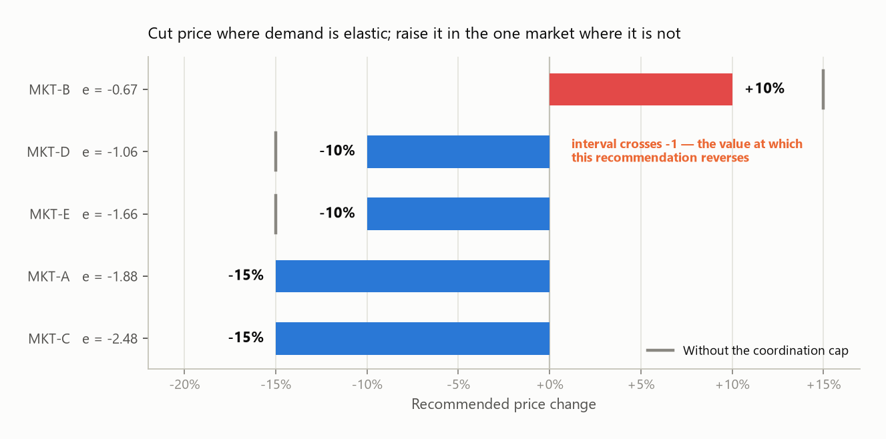

# pricing-demand-lab

[](https://github.com/Threeangletriangle/pricing-demand-lab/actions/workflows/ci.yml)

**A quarterly pricing decision for a five-market operation, taken end to end** — from what demand
does when price moves, to the prices to set under the rules the business actually operates under,
to how you would know afterwards whether the change worked.

> Worked example on simulated data with known parameters. That is a deliberate choice and it buys
> something specific — see [How this was built](#how-this-was-built).

---

## The decision

A five-market operation reviews prices once a quarter. Revenue Management can move prices in each
market, but not freely: prices ship in steps, no market may move more than 15% at once, total
volume cannot fall more than 3%, and **at most two markets may move sharply at the same time** —
because someone has to have that conversation with each local operator.

The question on the table is not "what is the revenue-maximising price." It is: *given those
rules, which markets do we move, in which direction, and what does obeying each rule cost us?*

---

## Recommendation

**Cut price in four markets, raise it in one. Expected effect: +12.22% revenue on +31.07% volume.**



| Market | Elasticity (95% CI) | Share of revenue | Move | Why |
|---|---|---|---|---|
| MKT-C | -2.48 [-2.84, -2.12] | 24.5% | **-15%** | Most elastic in the portfolio. Volume gained far outweighs the margin given up. |
| MKT-A | -1.88 [-2.08, -1.68] | 24.6% | **-15%** | Clearly elastic. Same logic, second-largest market. |
| MKT-E | -1.66 [-1.85, -1.46] | 16.4% | **-10%** | Elastic, but held at -10% by the two-market cap. |
| MKT-D | -1.06 [-1.33, -0.80] | 19.3% | **-10%** | **Direction not established** — see risks below. |
| MKT-B | -0.67 [-1.00, -0.34] | 15.2% | **+10%** | The only inelastic market. Demand falls slower than price rises, so revenue goes up. |

The rule underneath is one line: **raise price where |elasticity| < 1, cut it where |elasticity| > 1.**
Revenue moves with price as `p^(1+e)`, so the sign of `1+e` decides the direction. MKT-B is the
only market in the portfolio where that exponent is positive.

Two consequences worth stating plainly to the business:

- **This is a volume-led plan.** It buys 12% more revenue by moving 31% more units, concentrated in
  the two largest and most elastic markets. That is an operations question before it is a pricing
  one, which is why the demand forecast below is part of the case and not an appendix.
- **The plan is not the unconstrained optimum, and that is the point.** The unconstrained solution
  is +18.71%, but it is not executable.

---

## What the operating rules cost


| Scenario | Revenue uplift | Volume | Cost vs unconstrained |
|----------|---------------|--------|----------------------|
| **Recommended plan** (all constraints) | **+12.22%** | +31.07% | 6.49 pp |
| No cap on simultaneous large moves | +13.20% | +34.14% | 5.51 pp |
| No volume floor | +12.22% | +31.07% | 6.49 pp |
| No operating constraints (not executable) | +18.71% | +50.23% | — |

Two findings for the constraint owners:

- **The two-market coordination cap costs 0.98 points of uplift.** MKT-A and MKT-C take the two
  available slots, which holds the other three markets to 10% when the optimizer would move all of
  them 15%. That is now a number Revenue Management can weigh against the operational cost of
  running five simultaneous renegotiations, instead of a rule nobody has priced.
- **The volume floor costs nothing — it is not binding.** Every candidate plan already grows volume,
  so the floor never activates. It should stay in the model as a guardrail, but it should not be
  part of the negotiation.

This is the output I would take into the pricing committee. It converts each operating rule from a
hardcoded assumption into a line item someone can argue about.

---

## Why the elasticities can be trusted

The whole recommendation rests on five numbers, so they carry the burden of proof.


Price does not move at random — it moves with the season, alongside demand. An uncontrolled log-log
regression lets the price coefficient absorb the seasonality, and the bias is large and
**inconsistent in direction**: MKT-A comes out overstated, MKT-C understated by nearly a factor of
three.

| Market | True | Naive log-log | Controlled | 95% CI | Truth in CI |
|--------|------|---------------|------------|--------|-------------|
| MKT-A | -1.85 | -2.74 | **-1.88** | [-2.08, -1.68] | yes |
| MKT-B | -0.72 | -0.52 | **-0.67** | [-1.00, -0.34] | yes |
| MKT-C | -2.40 | -0.88 | **-2.48** | [-2.84, -2.12] | yes |
| MKT-D | -1.10 | -0.43 | **-1.06** | [-1.33, -0.80] | yes |
| MKT-E | -1.55 | -1.48 | **-1.66** | [-1.85, -1.46] | yes |

Mean absolute bias: **0.672 naive vs 0.060 controlled**. Coverage of the 95% interval: 5/5.

Two things this rules out. First, an analyst who validates on one market and finds the naive
estimate "close enough" carries the wrong conclusion into every other market — the error does not
have a consistent sign to correct for. Second, **you cannot price this portfolio off a single
pooled number**: a fixed-effects panel regression returns -0.84, while the simple average of the
true elasticities is -1.52. Pooling gives you a figure that describes no market in the portfolio,
and it happens to sit on the inelastic side of -1 — it would have recommended raising price
everywhere.

---

## Can the operation serve the volume?

The plan adds 31% volume. Whether that is an opportunity or an incident depends on whether demand
can be predicted well enough to staff for it.


Weekly demand per market, XGBoost on lag and Fourier seasonality features, validated
**walk-forward** over four blocks of 13 weeks — a random k-fold on time series trains on the future
and scores the past, which inflates the metric and says nothing about next Monday.

| Market | Model MAPE | Seasonal-naive MAPE | Lift | Worst fold |
|--------|-----------|---------------------|------|------------|
| MKT-A | 6.66% | 8.49% | 21.6% | 8.39% |
| MKT-B | 6.02% | 11.03% | 45.5% | 11.92% |
| MKT-C | 7.83% | 11.51% | 31.9% | 9.97% |
| MKT-D | 7.19% | 11.11% | 35.3% | 12.66% |
| MKT-E | 8.72% | 16.00% | 45.5% | 14.58% |

Mean 7.28% against a baseline of 11.63%. **The worst-fold column is in the table on purpose:** a
mean MAPE hides the quarter where the model failed, and that quarter is the one a capacity planner
remembers. At a worst fold of 12–15% in MKT-D and MKT-E, staffing to the point forecast alone would
be a mistake in those two markets.

**SHAP** explains the drivers case by case, which is the version a commercial team can argue with.
For MKT-C the ranking is last week's demand, the high-season flag, annual seasonality, weather
shock, and only then price — a useful corrective to a room that assumes price is the main lever.


---

## How we would know it worked

A forecast of +12.22% is a projection from a model. The number that decides whether the plan stays
deployed comes from a test.


- **Sized before it runs.** Detecting a 3% relative effect needs 19,098 users per group; 2% needs
  42,970. An underpowered test is not a small test — it returns "not significant" whether or not
  the effect is real, and that ambiguity costs more than not running it.
- **A/A test on the assignment pipeline:** -0.12%, p = 0.904. If this came back significant, the
  problem would be the randomization, not the business.
- **Result:** +2.89% unadjusted, CI [+0.88%, +4.90%]. With **CUPED** using pre-period spend as a
  covariate: +4.03%, CI [+2.89%, +5.17%] — a **43% narrower interval at the same sample size**.
  The unadjusted interval is compatible with an effect anywhere from negligible to large; the
  adjusted one supports a decision.

---

## What I would not do yet

The honest limits of this analysis, in the order I would raise them:

1. **Do not move MKT-D on this evidence.** Its interval, [-1.33, -0.80], crosses -1 — the exact
   value at which the recommendation flips from "cut" to "raise". The point estimate says cut; the
   data does not establish the direction. It is 19.3% of revenue, so the cost of being wrong is
   real. I would hold MKT-D flat and run a price test there first. The coordination cap already
   holds it to -10% by accident; I would make that deliberate and take it to 0%.

   The same caution applies in weaker form to **MKT-B**, the one price increase: its interval stops
   just short of the threshold at -0.995. The direction holds across the interval, but only barely,
   so I would treat the +10% as a test rather than a settled plan and stage it.
2. **The experiment contradicts the elasticity model, and that is unresolved.** For a +6% price
   move, an elasticity of -1.55 predicts a *negative* revenue effect (-3.15%); the test measures
   +4.03%. Both cannot be right. The two are estimated at different levels — market-week versus
   user — so the mapping between them is the first thing to check, along with cross-group
   contamination and effect heterogeneity. Reporting only the convenient number is the fastest way
   to lose a business partner's trust, so it is on the face of the case.
3. **Constant elasticity is an assumption, not a finding.** The model assumes elasticity does not
   change with the level of price, which makes a -15% move as trustworthy as a -5% one. It is not.
   I would stage the large cuts and re-estimate.
4. **No cross-market effects.** Markets are modelled independently: no substitution between them
   and no competitive response. A coordinated -15% in the two largest markets is exactly the kind
   of move a competitor reacts to.

---

## How this was built

**Why simulated data.** Client data cannot be published, and a public dataset has no known
elasticity — any estimate on it is unverifiable. Here the simulator sets each market's elasticity
as a parameter, so every estimator can be scored against the value that generated the data. That is
how you find out whether a method is sound *before* trusting it on data where the truth is not
observable. The bias table above is only possible because of it.

**Why a mixed-integer program.** Prices ship on a discrete grid, and "at most two markets may move
sharply at once" cannot be written without binary variables. The constraint that makes the problem
integral is the same one the business actually imposes.

**Why the tests matter.** The suite does not test implementation details — it tests the claims on
this page. If one fails, a conclusion above stops being true: the controlled estimator recovers the
truth and the naive one does not, the forecast features leak no future information, the optimizer
respects every constraint it claims to respect, CUPED narrows the interval without biasing the
estimate, and the A/A test stays quiet when there is nothing to detect. CI runs them on every push.

**Traceability.** Every forecasting run is logged to MLflow — parameters, metrics, validation
scheme — with models versioned in the registry, which answers the question that arrives three
months later: why is *this* the model in production, and which run produced it.

---

## Running it

```bash
pip install -r requirements.txt

python src/generate_data.py      # synthetic panel: 5 markets, 182 weeks
python src/elasticity.py         # three estimators scored against known truth
python src/forecast.py           # walk-forward validation, MLflow tracking, SHAP
python src/optimize_prices.py    # MIP price plan and constraint costing
python src/experiment.py         # power, A/A, uplift, CUPED
python src/figures.py            # regenerates every chart on this page

mlflow ui --backend-store-uri sqlite:///mlflow.db   # inspect the runs
pytest -q                                           # the claims above, as assertions
```

Or `make all`. Every number on this page comes from the committed seed.

## Layout

```
src/generate_data.py     synthetic multi-market panel with known elasticities
src/elasticity.py        naive / controlled / fixed-effects estimators + bias measurement
src/forecast.py          XGBoost forecasting, walk-forward CV, MLflow, SHAP
src/optimize_prices.py   MIP price optimization (PuLP + CBC), constraint cost analysis
src/experiment.py        power analysis, A/A test, difference in means, CUPED
src/figures.py           every chart on this page, generated from the modules above
tests/                   the claims on this page, as assertions
reports/                 generated figures
```

## Stack

Python · pandas · NumPy · statsmodels · scikit-learn · XGBoost · SHAP · PuLP/CBC · MLflow · SciPy · pytest · GitHub Actions

---

**María Fernanda Villa Gil** — Senior Data Scientist · MSc in Mathematics
[LinkedIn](https://www.linkedin.com/in/maria-fernanda-villa-gil-6474a3256) · mfv1118@gmail.com

Code comments are in Spanish; documentation in English.
